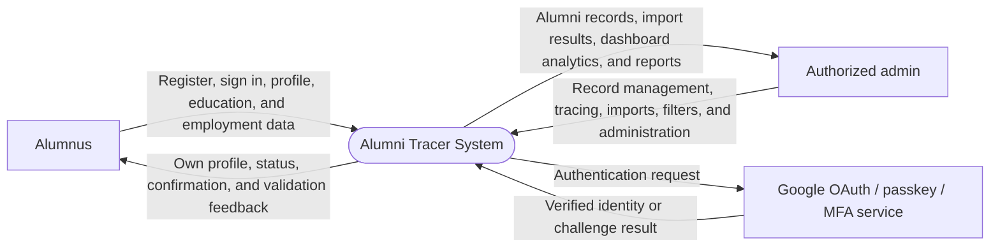

# Alumni Tracer - Data and Process Modeling

## Modeling choice

**Data and Process Modeling is the best primary model for this system.** Alumni
Tracer is centered on the movement and quality of alumni, education,
employment, tracing, and reporting data between two clients. It makes client
boundaries, authorization checkpoints, shared data stores, and reporting flows
easy to review with stakeholders.

The complementary object-oriented view remains in
[`object-modeling.md`](object-modeling.md). It is most useful when implementing
the application classes, database relationships, and authorization model.

## Scope and notation

- **Alumni client**: an alumnus accesses only their own information and submits
  profile, education, and employment updates.
- **Admin client**: authorized staff manage records, imports, tracing, programs,
  users, and aggregated reports.
- **Shared application**: validates requests, enforces authorization, and
  persists the shared data used by both clients.
- **[P]** marks a capability necessary for the two-client design but not yet
  fully represented in the current implementation, such as an explicit account-
  to-alumni relationship.

## Diagram shapes used

| Shape | Mermaid notation | ASCII notation | Meaning |
| --- | --- | --- | --- |
| External entity | `[Alumnus]` or `[Authorized admin]` | `[Alumnus]` / `[Authorized admin]` | A person or external service that exchanges data with the system. |
| Process | `([1.0 Process name])` | `(1.0 Process name)` | A system operation that transforms or validates data. |
| System boundary | `([Alumni Tracer System])` | `+ Alumni Tracer System +` | The combined alumni and admin application under analysis. |
| Data store | `[(D1 Data store)]` | `[D1 Data store]` | Persistent data read or written by a process. |
| Decision | `{Condition?}` | `{Condition?}` | A branch in the system flowchart. |
| Flow arrow | `-->` / `<-->` | `-->` / `<-->` | One-way or two-way movement of data or control. |

## 1. Context diagram



### ASCII drawing

```text
                         +---------------------------------------+
                         |         Alumni Tracer System          |
                         |  Alumni client + Admin client + data  |
                         +---------------------------------------+
                            ^             ^                |
                            |             |                | authentication request
                            |             |                v
     own profile, status    |             |       +--------------------------+
     validation feedback    |             |       | Google OAuth / passkey / |
                            |             |       | MFA authentication       |
                       +----------+  +------------------+  +--------------------------+
                       | Alumnus  |  | Authorized admin |
                       +----------+  +------------------+
                            |             |
                            |             |
                            |             +-- records, imports, tracing,
                            |                 administration, report filters
                            +-- registration, sign-in, profile, education,
                                and employment data
```

The system boundary contains both clients and their shared data. The two actors
have different permissions even though they use the same underlying application.

## 2. Data flow diagram (DFD - Level 0)

```mermaid
flowchart LR
    alumni[Alumnus]
    admin[Authorized admin]
    auth[Authentication provider]

    p1([1.0 Authenticate and authorize])
    p2([2.0 Maintain alumni self-service data])
    p3([3.0 Administer and trace alumni])
    p4([4.0 Import alumni data])
    p5([5.0 Generate analytics and reports])

    d1[(D1 Users, roles, and allocations)]
    d2[(D2 Alumni and programs)]
    d3[(D3 Education and employment history)]

    alumni -->|Credentials| p1
    admin -->|Credentials| p1
    p1 -->|Identity challenge| auth
    auth -->|Identity result| p1
    p1 <--> |Accounts and access scope| d1
    p1 -->|Authenticated session and allowed actions| alumni
    p1 -->|Authenticated session and allowed actions| admin

    alumni -->|Own profile, education, and employment changes| p2
    p2 -->|Validation result and current status| alumni
    p2 <--> |Owned alumni profile [P]| d2
    p2 <--> |Education and employment entries| d3

    admin -->|Record, tracing, program, user, and allocation changes| p3
    p3 -->|Saved record or access/validation feedback| admin
    p3 <--> |Alumni and programs| d2
    p3 <--> |Education and employment entries| d3
    p3 <--> |User access data| d1

    admin -->|XLSX file and import request| p4
    p4 -->|Import result and row errors| admin
    p4 -->|Validated alumni rows| d2

    admin -->|Dashboard/report request and filters| p5
    p5 -->|Aggregated statistics, charts, and filtered records| admin
    p5 -->|Read alumni/program data| d2
    p5 -->|Read education/employment data| d3
```

### ASCII drawing

```text
 [Alumnus] -- credentials --> (1.0 Authenticate) <--> [D1 Users / roles / allocations]
                                  |
                                  +------------------> [Authentication provider]
                                  |
                                  v
                    own changes (2.0 Self-service maintenance)
                                  |                 |
                                  v                 v
                      [D2 Alumni / programs]   [D3 Education / employment]

 [Admin] -- credentials --> (1.0 Authenticate)
 [Admin] -- records/tracing --> (3.0 Administer and trace) <--> D1, D2, D3
 [Admin] -- XLSX -----------> (4.0 Import alumni data) --------> D2
 [Admin] -- report filters -> (5.0 Analytics and reports) <----- D2, D3
```

### Data stores

| Store | Main contents | Used by |
| --- | --- | --- |
| D1 - Users, roles, and allocations | Accounts, credentials, MFA details, roles, management scopes, permissions, and allocation limits | Authentication and admin access control |
| D2 - Alumni and programs | Alumni identity/contact/tracing status, program assignment, and program catalog | Alumni self-service, admin records, imports, and reporting |
| D3 - Education and employment history | Further education entries, employer details, employment dates, current-employment flags, and document references | Alumni self-service, admin tracing, and reporting |

## 3. System flowchart

```mermaid
flowchart TD
    start([Start]) --> client{Open Alumni or Admin client?}

    client -->|Alumni client| alumniSignIn[Alumnus registers or signs in]
    client -->|Admin client| adminSignIn[Admin signs in]

    alumniSignIn --> alumniAuth{Authenticated?}
    adminSignIn --> adminAuth{Authenticated?}
    alumniAuth -->|No| accessError[Show authentication error or recovery option]
    adminAuth -->|No| accessError

    alumniAuth -->|Yes| binding{Account bound to an alumni record? [P]}
    binding -->|No| bindError[Show account-linking support message]
    binding -->|Yes| alumniAction[View or update own profile, education, or employment]

    adminAuth -->|Yes| adminScope{Action permitted by role and scope?}
    adminScope -->|No| accessDenied[Show access-denied message]
    adminScope -->|Yes| adminAction[Manage alumni, trace, import, manage programs/users, or view reports]

    alumniAction --> validate{Input valid and authorized?}
    adminAction --> validate
    validate -->|No| validationError[Show field-level validation errors]
    validationError --> alumniAction
    validate -->|Yes| persist[Write authorized changes to shared database]

    persist --> refresh{Reporting or tracing data affected?}
    refresh -->|Yes| aggregate[Refresh dashboard aggregates and status]
    refresh -->|No| success[Show success result]
    aggregate --> success
    success --> finish([End])
    accessError --> finish
    bindError --> finish
    accessDenied --> finish
```

### ASCII drawing

```text
 [Start]
    |
    v
 {Open which client?}
    | Alumni                                      | Admin
    v                                             v
 [Register / sign in]                       [Staff sign in]
    |                                             |
 {Authenticated?}                          {Authenticated?}
    | No --> [Authentication error]              | No --> [Authentication error]
    | Yes                                        | Yes
    v                                             v
 {Bound to alumni record? [P]}                {Role and scope allow action?}
    | No --> [Account-linking help]              | No --> [Access denied]
    | Yes                                        | Yes
    v                                             v
 [Update own profile, education,              [Manage records, trace, import,
  or employment]                               administer, or report]
                  \                              /
                   v                            v
                   {Input valid and authorized?}
                     | No              | Yes
                     v                 v
              [Validation errors]   [Write shared database]
                                           |
                                           v
                              {Status/reporting affected?}
                                  | No             | Yes
                                  v                v
                            [Show success]   [Refresh aggregates]
                                  \                /
                                           v
                                         [End]
```

## Requirements implied by the model

- The alumni client must resolve the authenticated account to one and only one
  alumni record before any self-service read or write operation.
- Every server-side write must validate the input and verify record ownership or
  admin scope; UI-only restrictions are insufficient.
- Admin analytics must read aggregated shared data while preventing alumni users
  from accessing other alumni's personal records.
- Spreadsheet imports must validate records before persistence and return row-
  level feedback when they fail.
- Tracing changes should record the responsible staff member and timestamp so
  reports have an accountable source.
