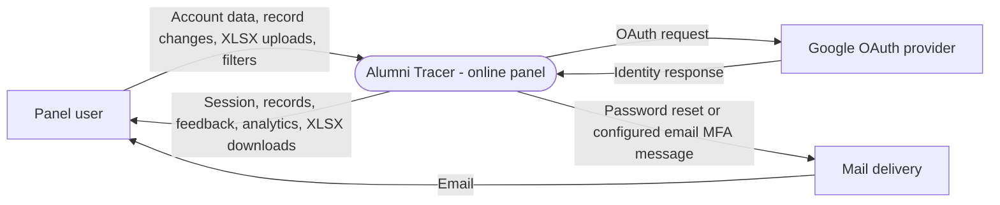
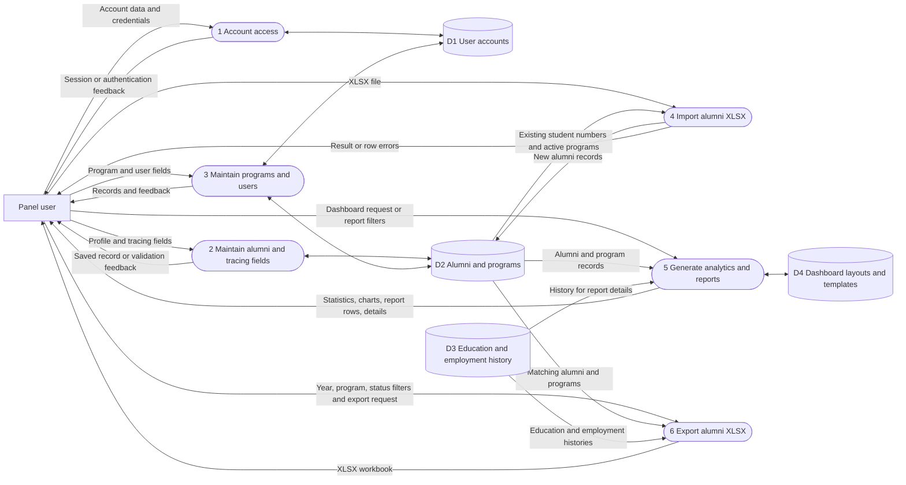
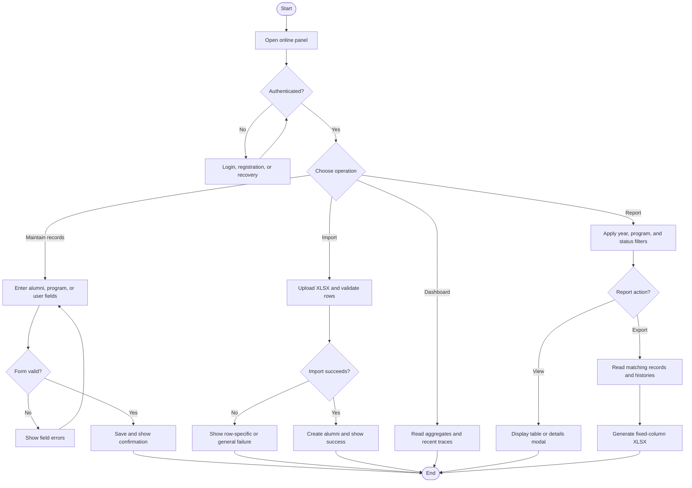

# Alumni Tracer - Data and Process Modeling

## Modeling choice

Data and process modeling describes how alumni records, imports, tracing data,
and reports move through the application. Class and interaction diagrams are in
[object-modeling.md](object-modeling.md); controls and acceptance criteria are in
[requirements-modeling.md](requirements-modeling.md).

## Scope and notation

The current system has one Laravel/Filament `online` panel at `/online`
and a shared database. The diagrams model its current management/reporting
flows. **Panel user** means an authenticated account using staff-oriented
functions; it does not imply enforced administrator permissions.

**[E]** means implemented, **[D]** means data structure only, and **[P]** means
planned. Alumni self-service and role/scope enforcement remain [P].

## Diagram shapes used

| Shape | Mermaid notation | ASCII notation | Meaning |
| --- | --- | --- | --- |
| External entity | `[Panel user]` | `[Panel user]` | Person/service exchanging data. |
| Process | `([Process])` | `(Process)` | Operation reading or transforming data. |
| System boundary | `([Alumni Tracer])` | `[Alumni Tracer]` | Application under analysis. |
| Data store | `[(Data store)]` | `[Data store]` | Persistent data. |
| Decision | `{Condition?}` | `{Condition?}` | Control-flow branch. |
| Arrow | `-->` / `<-->` | `-->` / `<-->` | Data/control flow. |

## 1. Context diagram



### ASCII drawing

```text
[Panel user] -- accounts / records / XLSX / filters --> [Alumni Tracer]
[Panel user] <-- session / feedback / reports / XLSX -- [Alumni Tracer]
                                                        |      ^
                                                        v      |
                                                      [Google OAuth]
[Alumni Tracer] -> [Mail delivery] -> [Panel user]
```

Google OAuth routes/UI are present; provider setup and end-to-end behavior need
verification. Passkeys use browser/device credentials and app MFA uses an
authenticator, rather than a shared external OAuth service. Turnstile challenges
are used on login/registration when configured.

## 2. Data flow diagram (DFD - Level 0)



### ASCII drawing

```text
[Panel user] -> (1 Account access) <-> [D1 Users]
[Panel user] -> (2 Alumni / tracing maintenance) <-> [D2 Alumni / programs]
[Panel user] -> (3 Program / user maintenance) <-> [D1, D2]
[Panel user] -> (4 XLSX import) <-> [D2]
[Panel user] -> (5 Analytics / reports) <- [D2, D3]
                    | dashboard customization
                    +------------------ <-> [D4 Layouts / templates]
[Panel user] -> (6 XLSX export) <- [D2, D3]
                    +--------------------> [XLSX download]
```

Histories are read by report details and export. The Alumni resource has no
history editor, so no history-write flow is shown. Roles/allocations are schema
structures [D], not an active permission process.

### Data stores

| Store | Tables and contents | Current use |
| --- | --- | --- |
| D1 - Accounts | `users`, sessions, password-reset tokens, MFA settings | Account access and Users resource |
| D2 - Alumni/programs | `alumnis`, `programs`; identity, contacts, graduation dates, status, tracing fields, program availability | Directory, maintenance, import, reports, export, analytics |
| D3 - History | `alumni_education`, `alumni_employments`; education, employers, dates, current-job flags, document references | Report details and XLSX; maintenance [P] |
| D4 - Dashboard customization | `widget_grid_layouts`, `widget_grid_templates`, `widget_grid_settings` | User layouts/templates through the widget-grid plugin |
| Access structures [D] | `roles`, `user_allocations`, nullable `users.user_allocation_id` | Permission/scope/allocation storage; management and enforcement [P] |

### Data definitions affecting flows

- `graduation_year` is a database **date**. Directory filtering uses an exact
  date; report/export filtering uses the calendar year.
- **Department** refers to a program name; no separate department table exists.
- `employment_status` is employed, unemployed, untraced, or null, stored on the
  alumni record rather than derived from employment history.
- `date_traced`, `trace_by`, and `remarks` are manually supplied.
- `instituion` preserves the current education column spelling.
- `supported_documents` is a reference string, displayed/exported as text,
  not an embedded file or an implemented document-upload workflow.
- Alumni, Program, and User use soft deletes. History tables have `deleted_at`,
  but their models do not apply soft-deletion scopes.

## 3. System flowchart



### ASCII drawing

```text
[Open online] -> {Authenticated?} -- No --> [Login / register / recover]
                       | Yes
                       v
                {Choose operation}
                  | Maintain -> [Validate form] -> [Save / field errors]
                  | Import -> [Validate XLSX] -> [Create / failure]
                  | Dashboard -> [Aggregates / recent traces]
                  + Report -> [Year / program / status filters]
                                | View -> [Table / details]
                                + Export -> [Records + histories] -> [XLSX]
```

### Report/export processing [E]

`AlumniDataReport` passes `graduationYear`, `programId`, and
`employmentStatus` to `AlumniDataExport`. Both use the Alumni scopes
`graduatedInYear`, `forProgram`, and `withEmploymentStatus`.

Export orders by ID, eagerly loads programs/histories, and writes one row per
alumnus with 15 fixed headings. Histories are combined into multiline cells.
Conditional formatting marks unemployed rows yellow and untraced rows light
red. Soft-deleted alumni are excluded. The filename includes the selected
graduation year when present.

Table search, sorting, pagination, and row selection do not affect the export.
No field selector, export audit store, or management-scope restriction exists.

### Analytics definitions [E]

- `AlumniStats`: total non-deleted alumni and counts/percentages by employment
  status; also shown on the directory.
- `AlumniLineChart`: status counts by graduation year from 2015 through the
  current year, rather than a time series of trace events.
- `AlumniByProgramChart`: status counts grouped by program.
- `EmploymentStatus`: distribution of the three employment statuses.
- `TracingProgress`: traced equals employed plus unemployed; the denominator
  adds untraced records. Null statuses are excluded.
- `RecentlyTraced`: records with a non-null trace date, ordered by that date.
- `ProgramStats`: total/active/inactive non-deleted programs on the Programs list.

## Planned flows [P]

The intended two-client design adds:

1. A stable relationship from each alumni account to exactly one alumni record.
2. Alumni reads/updates restricted to that account's own profile and histories.
3. Staff permissions and management scope on actions, reports, and exports.
4. Validated history maintenance and accountable tracing.
5. Consistent form/import/schema rules and active-program validation.
6. Export events and auditable changes.

`users.student_id` and `alumnis.student_number` are identifiers without a
foreign key or model relationship between them. Ownership, permission,
history-write, and audit flows are future requirements.
