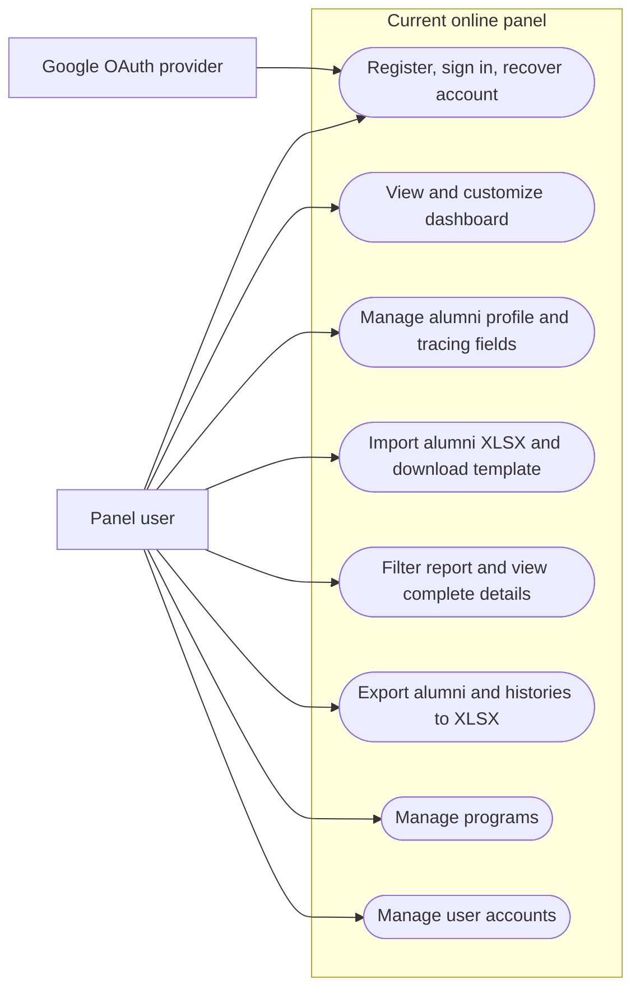
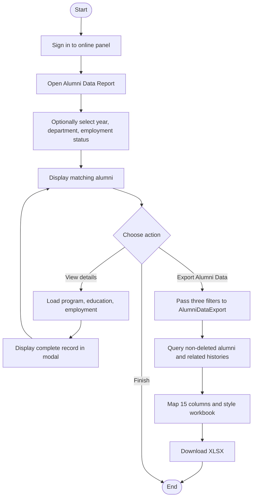
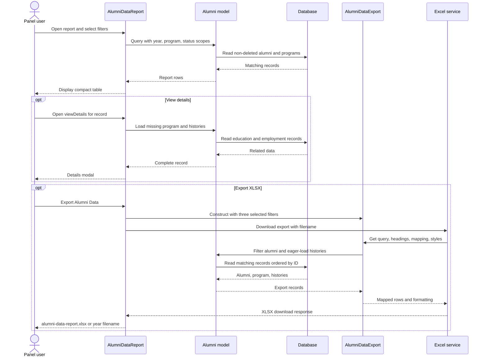
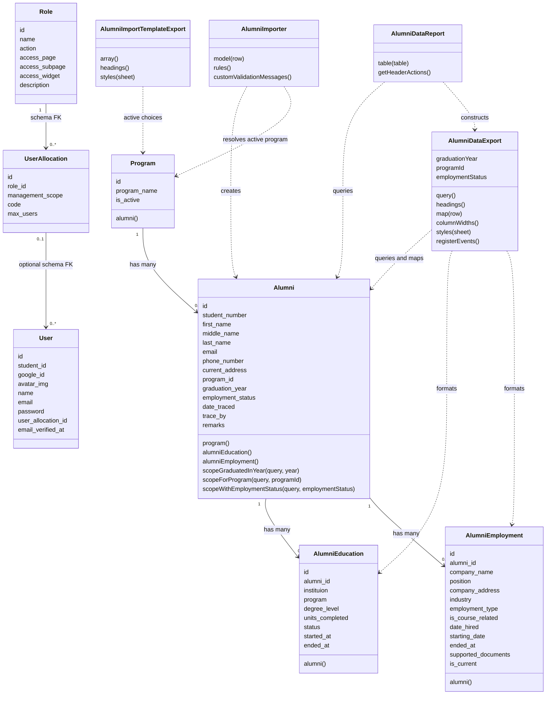

# Alumni Tracer - Object Modeling

## Scope and notation

These diagrams reflect the current working tree: one Filament `online` panel
with alumni/program/user resources, dashboard widgets, Alumni Data Report,
XLSX import, and XLSX export.

**[E]** means implemented, **[D]** means data model only, and **[P]** means
planned. An authenticated **panel user** performs the current staff-oriented
workflows. A separate alumni client, user-to-alumni binding, and role/scope
enforcement are planned rather than implemented interactions.

## Diagram shapes used

| Shape | Mermaid notation | ASCII notation | Meaning |
| --- | --- | --- | --- |
| Actor | `[Panel user]` | `PANEL USER` | Person initiating a use case. |
| Use case | `([Use case])` | `(Use case)` | User-visible capability. |
| Activity | `[Activity]` | `[Activity]` | Processing step. |
| Start/end | `([Start])` / `([End])` | `[Start]` / `[End]` | Activity boundary. |
| Decision | `{Question?}` | `{Question?}` | Branch condition. |
| Lifeline | `participant` | Vertical line | Sequence participant. |
| Class | `class ClassName` | `[ClassName]` | Object attributes/methods. |
| Association | `"1" --> "0..*"` | `1 ---- 0..*` | Relationship and multiplicity. |
| Dependency | `..>` | `. . .>` | A class uses another class. |

## 1. Use case diagram



### ASCII drawing

```text
PANEL USER
  +-> (Register / sign in / reset password / profile / configured MFA)
  +-> (View and customize dashboard)
  +-> (Create / view / edit alumni and tracing fields)
  +-> (Import XLSX / download import template)
  +-> (Filter report / view histories in details modal)
  +-> (Export XLSX using report year / program / status filters)
  +-> (Manage programs and user accounts)

Google OAuth -> (Account access integration)
Browser/device passkey -> (Sign-in integration)
```

Google OAuth and passkey routes/UI are present; end-to-end readiness needs
verification. Education/employment maintenance and role/allocation administration
are not current use cases. History viewing/export is implemented.

## 2. Activity diagram

This activity follows the implemented Alumni Data Report workflow.



### ASCII drawing

```text
[Sign in] -> [Open report] -> [Year / department / status filters]
                                      |
                                      v
                              [Matching alumni table]
                                | View details
                                +-> [Load program + histories] -> [Modal] -> [Table]
                                | Export
                                +-> [Three filters] -> [Query + map + style] -> [XLSX]
                                +-> [Finish]
```

The report/export do not currently resolve ownership or management scope.
Table search, sorting, pagination, and row selection do not constrain XLSX.
Alumni employment status and tracing values are separately edited through
the alumni form, not recalculated during reporting.

## 3. Sequence diagram



### ASCII drawing

```text
User -> Report -> Alumni -> Database
User <- Report <- Alumni <- Matching rows

Details:
User -> Report -> Alumni -> Database (program / histories)
User <- Report <- Alumni <- Complete record

Export:
User -> Report -> AlumniDataExport (year / program / status)
        Report -> Excel service -> Export -> Alumni -> Database
User <- Report <- Excel service <- mapped rows / workbook formatting
```

No export-audit write or permission/scope lookup occurs in this sequence.

## 4. Class diagram

The domain classes show selected schema attributes and implemented relationship
methods. Role/allocation associations reflect database foreign keys; the
corresponding Eloquent relationship methods are not defined.



### ASCII drawing

```text
[Role] 1 ---- 0..* [UserAllocation] 0..1 ---- 0..* [User]
        schema FK                   optional schema FK

[Program] 1 ---- 0..* [Alumni] 1 ---- 0..* [AlumniEducation]
                         |
                         +---- 0..* [AlumniEmployment]

[AlumniDataReport] . . .> [AlumniDataExport] . . .> [Alumni + histories]
        |                        year / program / status
        + . . .> [Alumni]

[AlumniImporter] . . .> [Alumni] and [Program]
[AlumniImportTemplateExport] . . .> [Program]
```

## Implementation notes

- `AlumniDataExport` is implemented in `app/Exports/AlumniDataExport.php`.
  It uses Laravel Excel query/mapping/formatting concerns; there is no
  `generateXlsx()`, `selected_fields`, or `generated_at` member.
- Its 15 headings are Student Number, First Name, Middle Name, Last Name,
  Email, Phone Number, Current Address, Program, Graduation Date, Employment
  Status, Remarks, Date Traced, Traced By, Education History, Employment History.
- `graduation_year` stores a date; `instituion` matches the schema spelling.
  `supported_documents` is a stored reference string.
- User, Alumni, and Program implement soft deletes. History tables, roles, and
  allocations also contain deletion timestamps, but their models do not use
  `SoftDeletes`.
- Alumni Education and Employment have no resource relation managers/editors.
  Existing history data is displayed in report details and exported.
- Role/allocation classes are currently placeholders without relationship or
  authorization logic. Report/export queries do not use their permissions.
- Framework, authentication-package, and widget-grid support classes are omitted
  from the domain diagram for readability.

## Planned two-client extension [P]

The intended alumni client must bind each account to exactly one alumni record
and authorize every profile/history request against that binding.
`users.student_id` and `alumnis.student_number` do not provide an implemented
foreign key or model relationship between User and Alumni.

The staff client must enforce roles/scopes for record management, reports, and
exports. History maintenance, allocation limits, automatic tracer attribution,
and export/change auditing also remain planned. They are not dependencies or
methods in the implemented class/sequence diagrams.
