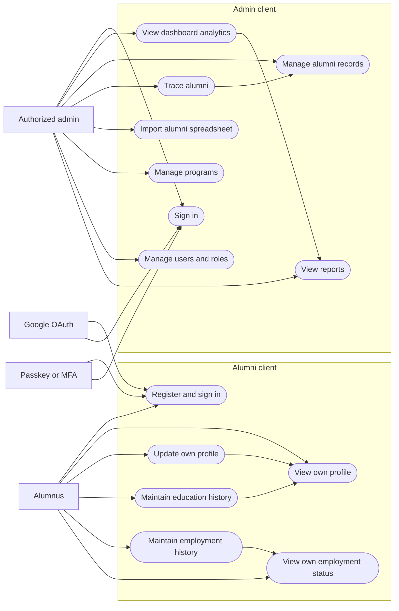
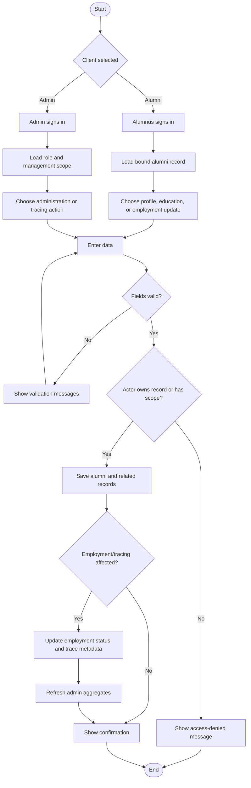
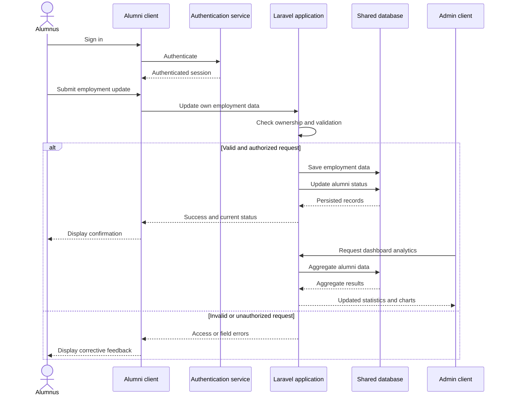
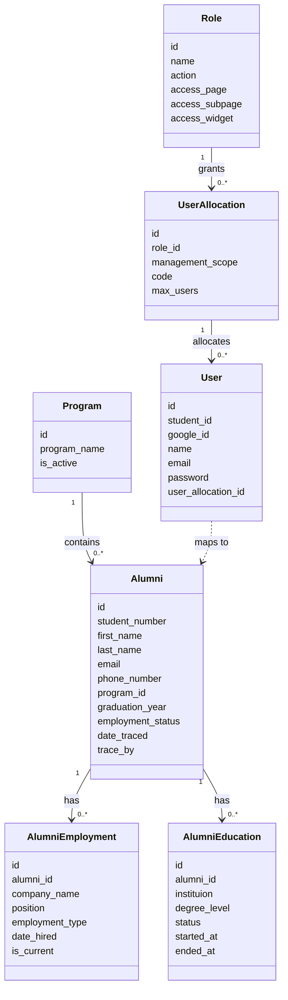

# Alumni Tracer - Object Modeling

## Scope and notation

These diagrams model the required split between the **Alumni client** and the
**Admin client** on top of the existing shared alumni data. The solid class
relationships reflect the current database/model structure. The dashed
`User`-to-`Alumni` link is an intended self-service identity binding and is not
currently represented by a foreign key.

## Diagram shapes used

| Shape | Mermaid notation | ASCII notation | Meaning |
| --- | --- | --- | --- |
| Actor | `[Alumnus]` / `[Authorized admin]` | `ALUMNUS` / `ADMIN` | A person or external service that initiates a use case. |
| Use case | `([Use case])` | `(Use case)` | A user-visible capability offered by one of the clients. |
| Activity | `[Activity]` | `[Activity]` | A processing step in the activity diagram. |
| Start/end | `([Start])` / `([End])` | `[Start]` / `[End]` | The entry or exit point of an activity flow. |
| Decision | `{Question?}` | `{Question?}` | A condition that selects a branch in an activity flow. |
| Lifeline | `participant` / vertical sequence line | `\|` | A participant's timeline in the sequence diagram. |
| Class | `class ClassName` | `[ClassName]` | A data/object type and its attributes. |
| Association | `"1" --> "0..*"` | `1 ---- 0..*` | A relationship and its multiplicity. |
| Dependency | `..>` / `-.->` | `. . .>` | A non-owning use or proposed relationship. |

## 1. Use case diagram



### ASCII drawing

```text
 ALUMNUS                                  ADMIN
    |                                       |
    +--> (Register / sign in)               +--> (Sign in)
    +--> (View own profile)                 +--> (View dashboard analytics)
    +--> (Update own profile)               +--> (Manage alumni records)
    +--> (Maintain education history)       +--> (Trace alumni)
    +--> (Maintain employment history)      +--> (Import alumni spreadsheet)
    +--> (View own status)                  +--> (Manage programs)
                                            +--> (Manage users, roles, allocations)
                                            +--> (Filter records / reports)

 Google OAuth ----------------------------> (Register / sign in)
 Passkey or MFA authenticator ------------> (Register / sign in and Sign in)
```

## 2. Activity diagram

The activity diagram focuses on the shared profile/employment-update flow while
showing the different authorization paths for each client.



### ASCII drawing

```text
 [Start]
    |
    v
 {Alumni client or Admin client?}
    | Alumni                         | Admin
    v                                v
 [Sign in]                    [Sign in]
    |                                |
 [Load owned record]          [Load role and scope]
    |                                |
    +------------> [Choose / enter update or tracing data] <---+
                                  |
                                  v
                         {Fields valid?}
                          | No       | Yes
                          v          v
                    [Show errors]  {Own record or permitted scope?}
                                      | No          | Yes
                                      v             v
                               [Access denied]   [Save data]
                                                       |
                                                [Refresh status / analytics]
                                                       |
                                                     [End]
```

## 3. Sequence diagram

This sequence models an alumni self-service employment update and the resulting
availability of current data to the admin dashboard.



### ASCII drawing

```text
 Alumnus       Alumni client       Auth service       Laravel app        Database       Admin client
    |                 |                  |                 |                 |                |
    |-- sign in ----->|-- authenticate ->|                 |                 |                |
    |                 |<-- session ------|                 |                 |                |
    |-- update ------>|-------------------------------> verify ownership     |                |
    |                 |                                 and validate         |                |
    |                 |              invalid / unauthorized --> field errors |                |
    |                 |<------------------------------------ errors --------- |                |
    |                 |                                 |-- save employment ->|
    |                 |                                 |-- update status --->|
    |<-- confirmation-|<-------------------------------- success ------------|
    |                 |                                 |<-- dashboard request--|
    |                 |                                 |-- aggregate ------->|
    |                 |                                 |---- analytics ------>|
```

## 4. Class diagram



### ASCII drawing

```text
 [Role] 1 -------------------- 0..* [UserAllocation] 1 -------------------- 0..* [User]
   |                                      |                                      |
   | name, permission JSON                 | management scope, code, max users    | account identity
   |                                      |                                      |
   +--------------------------------------+                                      |
                                                                          [P] maps one account
                                                                              to one alumni record
                                                                                  . . . . . . . .
                                                                                  .             .
 [Program] 1 ------------------ 0..* [Alumni] 1 ------------------- 0..* [AlumniEmployment]
                                         |
                                         +-------------------------- 0..* [AlumniEducation]

 Program: catalog data                 Alumni: identity, contact, tracing status
 Employment: company and current-job   Education: institution, degree, dates
```

## Implementation note

The current codebase has the `User`, `UserAllocation`, `Role`, `Alumni`,
`Program`, `AlumniEmployment`, and `AlumniEducation` data structures modeled
above. The `instituion` spelling mirrors the current database column. Before
exposing the Alumni client, add an explicit relationship between the
authenticated user and exactly one alumni record, then enforce that
relationship in every profile, education, and employment request.
