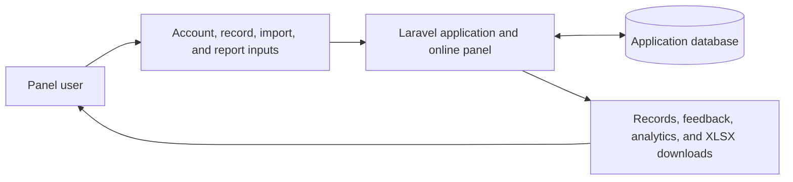
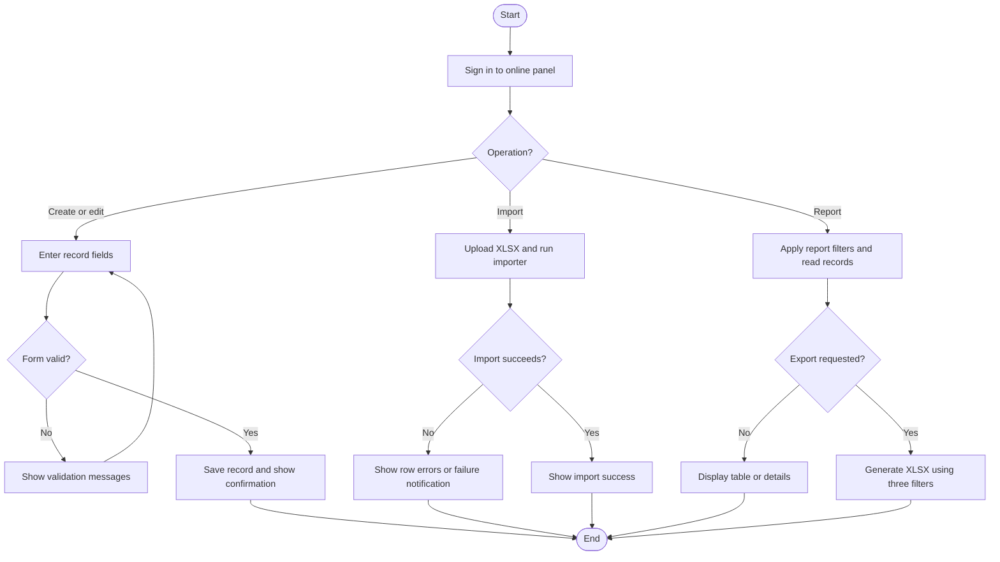
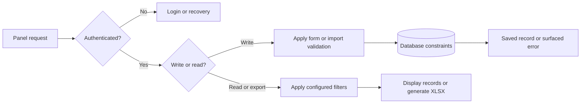

# Alumni Tracer - Requirements Modeling

## Scope and notation

This document reflects the current working tree, including Alumni Data Report
and XLSX export. The application currently provides one Filament panel,
identified as `online`, at `/online`. Its management functions are intended
for institutional staff. A separate alumni self-service client remains planned.

- **[E] Implemented**: represented by application code and routes.
- **[D] Data model only**: tables/models without a complete management workflow.
- **[P] Planned**: required by the intended two-client design but not implemented.

Implemented functionality does not imply verified production readiness.
Role permissions and management scopes exist in the schema but are not applied
to current report/export queries.

## Diagram shapes used

| Shape | Mermaid notation | ASCII notation | Meaning |
| --- | --- | --- | --- |
| Rectangle | `[Activity]` | `[Activity]` | Client, activity, input, or output. |
| Rounded rectangle | `([Start or End])` | `[Start]` / `[End]` | Process boundary. |
| Diamond | `{Decision?}` | `{Decision?}` | Decision with labelled outcomes. |
| Cylinder | `[(Data store)]` | `[Data store]` | Persistent application data. |
| Arrow | `-->` | `-->` | Direction of data or control flow. |

## 1. Input-Process-Output (IPO) model

| Feature | Inputs | Current processing | Outputs | Status |
| --- | --- | --- | --- | --- |
| Account access | Name, email, password; configured authentication challenges | Shared panel registration/login, password reset, profile settings, app/email MFA configuration | Account, session, or authentication feedback | [E]; Google OAuth routes/buttons and passkey routes/UI are present and require integration verification |
| Alumni profile maintenance | Student number, name, contacts, program, graduation date, status, tracing fields | Validate the form and create/edit the alumni record | Saved record and confirmation | [E] staff-oriented workflow; alumni ownership enforcement [P] |
| Alumni tracing | Employment status, `date_traced`, `trace_by`, remarks | Save manually entered values and read them in reports/widgets | Updated tracing fields | [E]; tracer is text, not automatically bound to the signed-in account |
| Education/employment history | Related history records | Store through models; read existing histories in report details and XLSX output | Education and employment details | [D] maintenance; [E] display/export; editing workflows [P] |
| Alumni directory | Search, programs, status, exact graduation date, deleted-record filter | Query matching alumni and their programs | Directory, view/edit actions, employment statistics | [E]; statistics count all non-deleted alumni rather than filtered rows |
| XLSX import | Uploaded spreadsheet with supported headings | Validate rows, check duplicate student numbers, resolve active programs by name, convert Excel dates, create alumni | Success, row-specific validation errors, or failure notification | [E]; existing-record updates and history imports are not supported |
| Alumni Data Report | Graduation year, department/program, status, table search | Filter non-deleted alumni; load histories into a details modal | Compact table and complete record details | [E] |
| Alumni data export | Report year, department/program, status filters | Query matching non-deleted alumni and histories; map fixed columns and format XLSX | `alumni-data-report.xlsx` or `alumni-data-report-{year}.xlsx` | [E]; search/selected rows, field selection, role scope, audit logging are not applied |
| Program administration | Name, active flag, status/deleted-record filters | Create through list action; view/edit, soft-delete, restore, force-delete | Catalog and total/active/inactive statistics | [E]; no separate registered create route |
| User administration | Account fields and deleted-record filter | Users resource lists, creates, views, edits, deletes, and restores accounts | User records | [E]; role/allocation administration [P] |
| Analytics | Alumni, programs, statuses, graduation and trace dates | Aggregate counts and read recently traced alumni | Dashboard and directory/program statistics | [E] |
| Roles and allocations | Permission JSON, scope, code, maximum users | Store roles/allocations and optionally reference an allocation from a user | Access-management data structures | [D]; enforcement and allocation-limit checks [P] |

### IPO data flow



### ASCII drawing

```text
[Panel user] -> [Inputs] -> [Laravel / online panel] <-> [Database]
     ^                              |
     +---- records, feedback, analytics, XLSX downloads --------+
```

## 2. Process model

### Alumni information and tracing update [E]

1. Sign in to the `online` panel and open the Alumni Directory.
2. Create a record or open an existing record for editing.
3. Supply identity, contact, program, and graduation data, plus optional
   employment status, trace date, tracer name, and remarks.
4. The configured form validates fields and saves the alumni record.
5. Confirmation is shown; subsequent report/widget queries read the new values.

The form does not edit education/employment histories or derive employment
status from them. Saving does not automatically set `date_traced` or `trace_by`.

### Bulk import [E]

1. Open **Import Excel** and download `alumni-template.xlsx` if needed.
2. Complete the XLSX using active program names and Excel date values.
3. Upload the file. `AlumniImporter` validates rows and checks student-number
   uniqueness against existing data and duplicates within the import batch.
4. The importer resolves active programs, converts dates, and creates alumni.
   It does not update existing records or create history entries.
5. Success is reported after the import returns successfully. Validation errors
   identify rows/student numbers; other exceptions produce a failure notification.

The template contains nine headings: `student_number`, `first_name`,
`middle_name`, `last_name`, `email`, `phone_number`, `program`,
`graduation_year`, and `current_address`. The importer additionally accepts
optional employment/tracing columns absent from the template. Validation
differences between importer, form, and schema remain listed under controls.

### Report and XLSX export [E]

1. Open **Alumni Data Report** under **Reports**.
2. Optionally filter by graduation year, department, and employment status.
   Department means the related `Program`, not a separate department entity.
3. View matching rows or open **View details** for personal data and histories.
4. **Export Alumni Data** passes the three selected filters to
   `AlumniDataExport`. No filters means all non-deleted alumni.
5. The export loads programs and histories and writes one row per alumnus with
   15 fixed columns. Multiple history entries become multiline cell contents.
6. Download the workbook with a maroon header, wrapped history columns, yellow
   unemployed rows, and light red untraced rows.

Table search, sorting, pagination, and row selection do not constrain export.
No export audit event or management-scope restriction is implemented.

### Current operation flow



### ASCII drawing

```text
[Sign in] -> {Operation?}
  | Create/edit -> [Enter fields] -> {Valid?} -> [Save / confirmation]
  |                                  | No
  |                                  +-> [Field errors] -> [Enter fields]
  | Import -> [Run XLSX importer] -> [Success or row/failure notification]
  + Report -> [Read filtered records] -> [Table / details / XLSX]
```

## 3. Control model

### Current controls and planned boundaries

| Area | Current implementation | Remaining requirement |
| --- | --- | --- |
| Panel access | Filament authentication middleware | Enforce staff permissions before treating the panel as admin-only [P] |
| Registration/identity | Shared registration; nullable `users.student_id` | Bind alumni accounts to exactly one alumni record and separate alumni/staff access [P] |
| Roles/scope | Permission fields, `management_scope`, `max_users` exist | Apply role/page/action/widget permissions, record scope, allocation limits [P] |
| Ownership | No user-to-alumni relationship or ownership filter in reports/exports | Check ownership on every alumni self-service request [P] |
| Required data | Form requires student number, first/last names, email, phone, address, program, graduation date | Align form/import rules with non-null schema columns, including optional middle name/contact import values [P] |
| Student-number uniqueness | Import checks uniqueness and import-batch duplicates | Add equivalent form validation and database uniqueness; neither exists currently [P] |
| Employment status | Form choices and database enum: employed, unemployed, untraced; null allowed | Validate imported values against the same set [P] |
| Programs | Foreign key; active-only template/import lookup | Validate active programs consistently; alumni form choices are not restricted to active programs [P] |
| History dates | Education/employment dates stored | Add maintenance forms and chronological validation [P] |
| Tracing | Manually entered date, tracer text, remarks | Record responsible account automatically and retain change history [P] |
| Export | Three filters, fixed columns, deleted alumni excluded | Enforce permission/scope and record export events; optional field selection [P] |
| Recovery | User, Program, Alumni models use soft deletes; resource actions restore/force-delete | History tables have `deleted_at` but their models lack `SoftDeletes`; forced program/alumni deletion can cascade to dependents |
| Email verification | User implements `MustVerifyEmail` | Panel email-verification enforcement is not configured [P] |

### Implemented validation checkpoint



### ASCII drawing

```text
[Request] -> {Authenticated?} -- No --> [Login / recovery]
                     | Yes
                     v
               {Write or read?}
                 | Write -> [Validation] -> [Database] -> [Result / error]
                 + Read  -> [Configured filters] -> [Records / XLSX]
```

Role/scope and ownership checks are planned, not implemented checkpoints.

## Acceptance criteria

### Current workflows

- Alumni creation/editing, search, program/status/date filters, and recovery
  actions are available in the directory.
- Import validation failures identify the row/student number.
- The report's three filters also constrain XLSX export.
- Report details and exported rows include existing education/employment data.
- XLSX uses 15 fixed columns and employment-status row highlighting.
- Reports/statistics use non-deleted alumni by default.

### Planned two-client design [P]

- Alumni can access only their bound profile and histories through all requests.
- Staff actions, reports, and exports enforce role and management scope.
- History maintenance validates required data and chronological ranges.
- Alumni uniqueness and form/import/database validation are consistent.
- Exports record requester, filters, fields, record count, and timestamp.
- Tracing and self-service edits retain accountable change history.

## Implementation references

- Panel/authentication: `app/Providers/Filament/AlumniPanelProvider.php`,
  `routes/web.php`, `app/Models/User.php`.
- Forms/import: `app/Filament/Resources/Alumnis/Schemas/AlumniForm.php`,
  `app/Filament/Resources/Alumnis/Tables/AlumnisTable.php`,
  `app/Filament/Imports/AlumniImporter.php`.
- Reports/export: `app/Filament/Pages/AlumniDataReport.php`,
  `app/Exports/AlumniDataExport.php`.
- Data definitions: `database/migrations/`.
