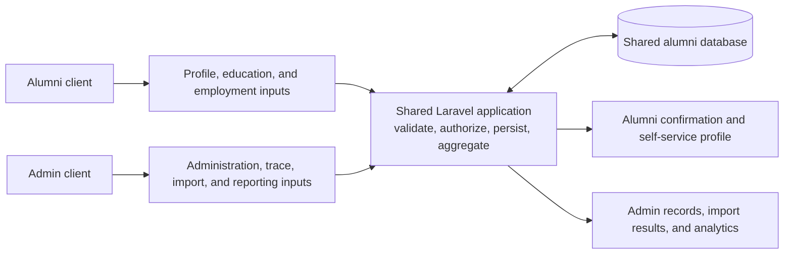
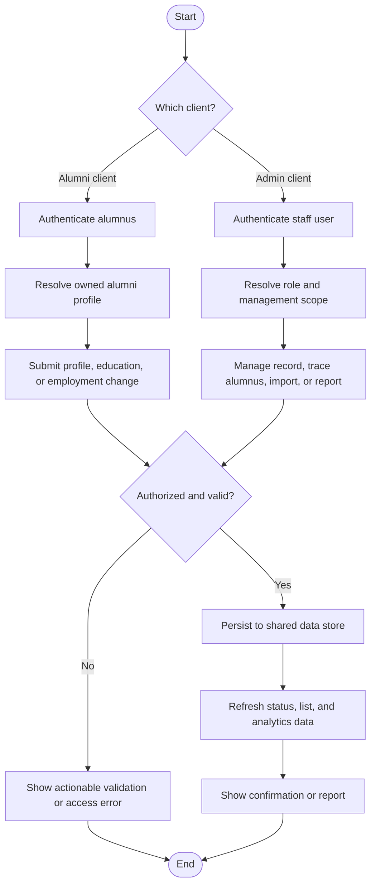
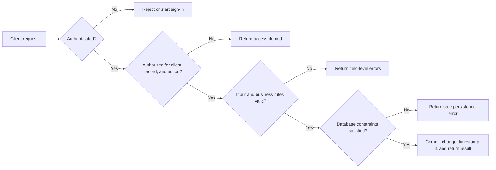

# Alumni Tracer - Requirements Modeling

## Scope and notation

This document models the Alumni Tracer as two clients that use one shared
application and database:

- **Alumni client**: self-service access for an alumnus to authenticate and
  maintain only their own profile, education, and employment information.
- **Admin client**: institutional access for authorized staff to manage alumni
  data, programs, users, imports, and reporting.

`[E]` identifies functionality or data already represented in the current
application. `[P]` identifies a requirement needed to complete the separated
alumni-client/admin-client design.

## Diagram shapes used

| Shape | Mermaid notation | ASCII notation | Meaning |
| --- | --- | --- | --- |
| Rectangle | `[Process or client]` | `[Process or client]` | A client, activity, input, output, or system function. |
| Rounded rectangle | `([Start or End])` | `[Start]` / `[End]` | The beginning or end of a process flow. |
| Diamond | `{Decision?}` | `{Decision?}` | A control or validation decision with labelled outcomes. |
| Data store cylinder | `[(Shared data)]` | `+ Shared data store +` | Persistent shared application data. |
| Arrow | `-->` | `-->` | Direction of a process, data, or control flow. |

## 1. Input-Process-Output (IPO) model

| Feature | Inputs | Processing | Outputs | Client |
| --- | --- | --- | --- | --- |
| Account access | Email and password; Google identity; passkey; MFA code | Validate credentials, establish session, verify email, and apply account access rules | Authenticated session or a clear authentication error | Alumni and Admin |
| Alumni profile maintenance | Personal details, contact details, program, graduation year | Validate required fields and authorized ownership; create or update the alumni record | Current alumni profile and confirmation | Alumni [P] / Admin [E] |
| Employment update | Employer, position, address, industry, employment type, course relevance, dates, supporting document reference, current-job flag | Validate fields, store employment history, and set the current employment state used for tracing | Employment record, updated employment status, and trace date | Alumni [P] / Admin [E] |
| Education update | Institution, program, degree level, units, status, start date, end date | Validate chronological and required data; store education history against the alumnus | Education-history record | Alumni [P] / Admin [E data model] |
| Alumni tracing | Search/filter criteria; verified contact or employment information; tracing remarks | Locate the alumnus, update contact/employment status, record `date_traced` and `trace_by` | Updated tracing state and a traceable record | Admin [E] |
| Alumni administration | Individual form values or XLSX import | Validate rows, prevent duplicate student numbers, create/update records, and surface import results | Alumni list, individual record, or import success/error report | Admin [E] |
| Program administration | Program name and active state | Validate and save the program; retain historical data when a program is deactivated or deleted | Program catalog used by alumni records | Admin [E] |
| User and access administration | User details, role allocation, management scope, maximum-user allocation | Validate user and allocation data; enforce role/page/action permissions | Authorized staff account with defined scope | Admin [E data model; P enforcement review] |
| Analytics and reporting | Alumni, program, employment-status, and tracing data; optional filters | Aggregate counts by status, program, and time | Dashboard statistics, employment distribution, tracing progress, recent traces, and export-ready views | Admin [E] |

### IPO data flow



### ASCII drawing

```text
+----------------+     profile / education / employment     +-------------------------+
| Alumni client  | ---------------------------------------> | Shared Laravel app      |
+----------------+                                          | validate, authorize,    |
                                                            | persist, aggregate      |
+----------------+     records / tracing / imports /        +-----------+-------------+
| Admin client   |     reporting                                         |
+----------------+ --------------------------------------->             | read / write
                                                                         v
                                                                  +--------------+
                                                                  | Shared data  |
                                                                  |    store     |
                                                                  +--------------+
       ^ confirmation / own profile                 ^ records / reports / analytics
       |                                            |
  Alumni client                                Admin client
```

## 2. Process model

### Core business process: update alumni information

1. The actor signs in through the client appropriate to their role.
2. The system authenticates the actor and determines whether the request is for
   the actor's own alumni record or an institution-managed record.
3. The actor enters or changes profile, education, or employment information.
4. The system validates the request, including required fields, permitted
   values, dates, and authorization.
5. The system writes the valid changes to the alumni record and its related
   education or employment records.
6. The system recalculates or records the alumni employment/tracing state when
   applicable and preserves timestamps.
7. The actor receives success feedback; admins can use the updated record in
   lists, filters, and dashboard aggregates.

### Admin bulk-import process

1. An admin downloads the supported alumni template.
2. The admin uploads a completed XLSX file.
3. The system validates each row, including required fields, program matching,
   and duplicate student-number checks.
4. Invalid rows are reported without presenting the import as fully successful.
5. Valid rows are persisted as alumni records.
6. The system confirms the outcome and refreshed data becomes available to
   tables and dashboard reporting.

### Client-boundary process



### ASCII drawing

```text
 [Start]
    |
    v
 {Which client?} ---- Alumni ---> [Authenticate alumnus] --> [Load own record]
    |                                                         |
    | Admin                                                   v
    +--------------> [Authenticate staff] --> [Load role and scope]
                                                          |
                                                          v
                                               [Submit requested action]
                                                          |
                                                          v
                                           {Authorized and valid?}
                                             | No              | Yes
                                             v                 v
                                      [Show error]       [Persist changes]
                                             |                 |
                                             +-------> [Refresh reports]
                                                               |
                                                               v
                                                            [End]
```

## 3. Control model

### Access-control matrix

| Capability | Alumni client | Admin client | Control requirement |
| --- | --- | --- | --- |
| Register, sign in, reset password, use Google/passkey/MFA | Own account only | Staff account only | Authentication must be required for protected functions. |
| View alumni profile | Own record only | Records within assigned management scope | Enforce record ownership for alumni and role/scope authorization for admins. |
| Edit personal/contact information | Own record only | Authorized records | Server-side authorization is required; hiding a UI action is not sufficient. |
| Create/edit education and employment history | Own history only | Authorized records | Validate ownership, dates, and required values before writing related records. |
| Trace alumni and set `trace_by` / `date_traced` | No | Yes | Limit tracing fields to authorized staff and retain source/timestamp information. |
| Create/delete/restore alumni records | No | Yes | Use least privilege and preserve soft-deleted records for recovery. |
| Import alumni spreadsheet | No | Yes | Restrict upload type and size; validate every row and report failures. |
| Manage programs, users, roles, and allocations | No | Authorized administrators only | Enforce action/page/widget permissions and allocation limits. |
| View aggregate analytics | Personal status only [P] | Institutional aggregates | Do not expose other alumni's personal details through alumni-facing reports. |

### Data and integrity controls

| Control area | Requirement |
| --- | --- |
| Identity binding [P] | Bind each alumni-client account to exactly one alumni record through an explicit, stable relationship. The current schema has `users.student_id` and `alumnis.student_number` but no foreign key linking them. |
| Required data | Require identity, contact, program, and graduation fields for alumni records; require the specified employment and education fields before saving their entries. |
| Permitted values | Limit `employment_status` to `employed`, `unemployed`, or `untraced`; use controlled options for program and employment fields where applicable. |
| Referential integrity | An alumni record must reference a valid program. Education and employment entries must reference a valid alumni record. User allocations must reference a valid role. |
| Uniqueness | Enforce unique user email addresses, role names, allocation codes, and alumni student identifiers. The spreadsheet import already checks for duplicate student numbers; this should also be protected consistently at the persistence boundary. |
| Date consistency | Reject impossible ranges, such as an education end date before its start date or an employment end date before its hire/start date. |
| Privacy | Minimize personal data shown in dashboards and lists, restrict exports to authorized admins, and protect uploads and supporting-document references from unauthorized access. |
| Recovery and accountability | Retain timestamps and soft-deletion behavior. Record the staff actor and timestamp for tracing changes; add an auditable change history for self-service edits before production rollout [P]. |
| Error handling | Return field-level validation errors and access-denied responses without exposing other alumni records or sensitive system details. |

### Control checkpoints



### ASCII drawing

```text
 [Client request]
        |
        v
 {Authenticated?} -- No --> [Reject / start sign-in]
        |
       Yes
        v
 {Allowed client, record, and action?} -- No --> [Access denied]
        |
       Yes
        v
 {Input and business rules valid?} -- No --> [Field-level errors]
        |
       Yes
        v
 {Database constraints satisfied?} -- No --> [Safe persistence error]
        |
       Yes
        v
 [Commit + timestamp + return result]
```

## Acceptance criteria for the two-client design

- An alumnus can never read or modify another alumnus's record through either
  UI navigation or a direct request.
- An admin can perform only the actions permitted by their role and management
  scope.
- Profile, education, and employment changes are validated on the server and
  are visible in the appropriate admin records and analytics.
- Imports provide a clear success/failure result and never silently accept
  invalid or duplicate data.
- Analytics aggregate shared data for admins without disclosing private records
  to alumni users.
- The account-to-alumni identity binding is implemented before enabling alumni
  self-service editing.
